# MernGrove - Interior Decor Application

## Overview

MernGrove is a full-stack e-commerce web application tailored for interior decor shopping. It allows users to browse, favorite, and purchase home decor products with a sleek and modern UI. The project currently focuses on the frontend experience with extendable backend support.

---

## Key Features

- User authentication with registration/login flow
- Product listing with categories like featured and new arrivals
- Add to cart, view and manage cart items
- Wishlist functionality
- Order confirmation screen
- Responsive layout with clean UI
- Extendable for admin management and backend integration

---

## Tech Stack

| Layer        | Tools                      |
|--------------|-----------------------------|
| Frontend     | React.js, Tailwind CSS, React Router |
| State Mgmt   | Context API                 |
| Styling      | Tailwind CSS                |
| Backend (Planned) | Node.js, Express, MongoDB |
| File Structure | Modular component-based design |

---

## Output Screenshots

### Authentication Flow

- Register Page
  
  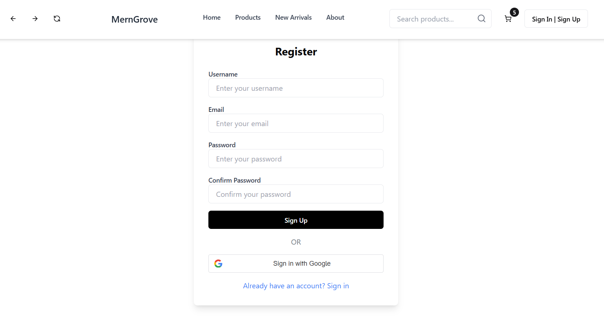

- Login Page
  
  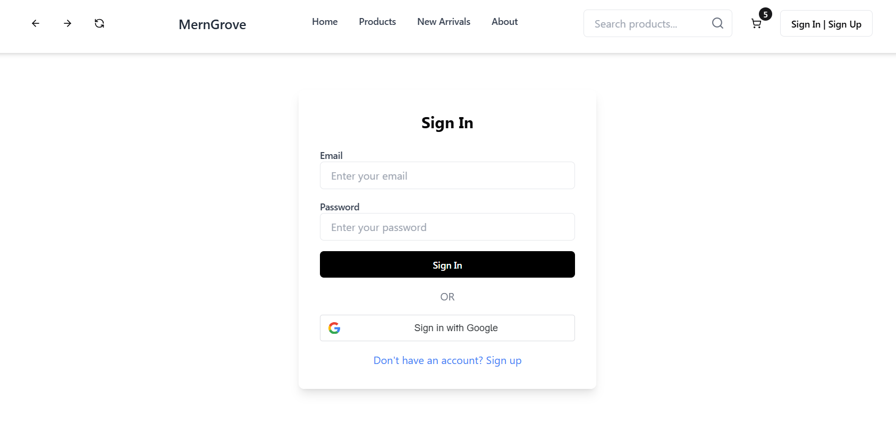

---

### User Flow

- Homepage
  
  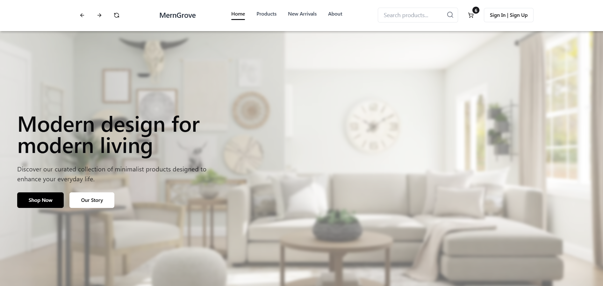

- Product Listing
  
  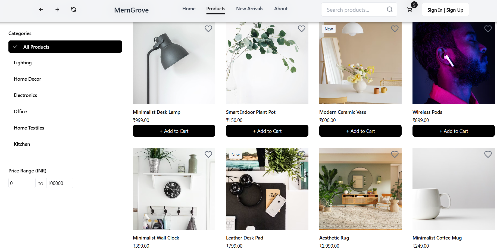

- Featured Products
  
  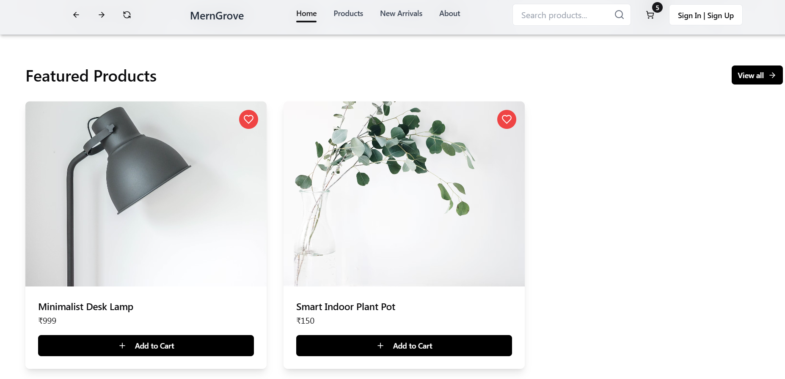

- New Arrivals
  
  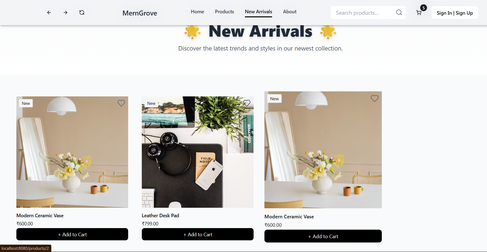

- Cart
  
  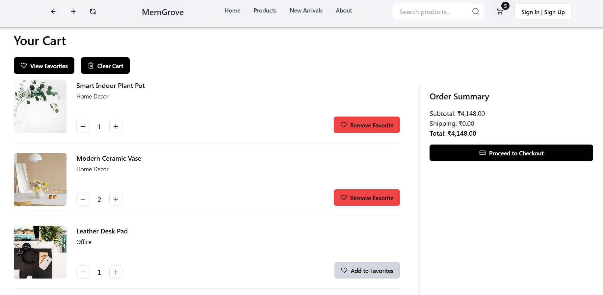

- Favourites
  
  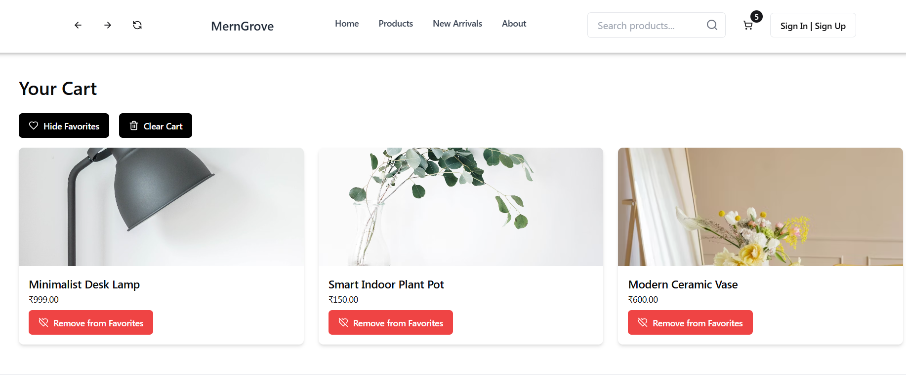

- About Page
  
  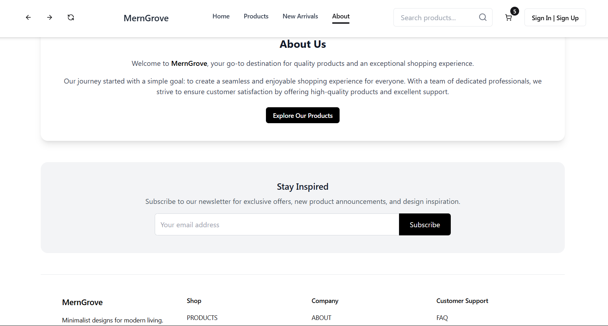

---

### Checkout Flow

- Step 1
  
  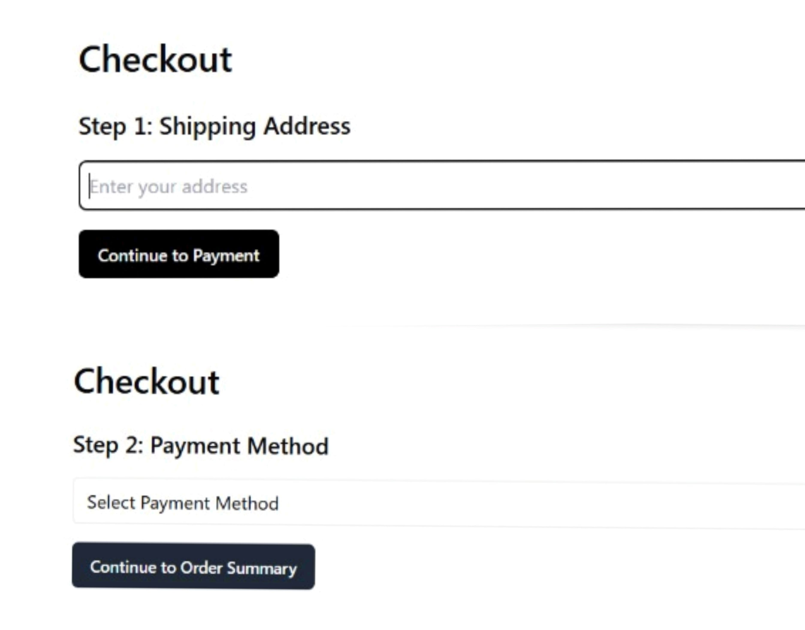

- Step 2
  
  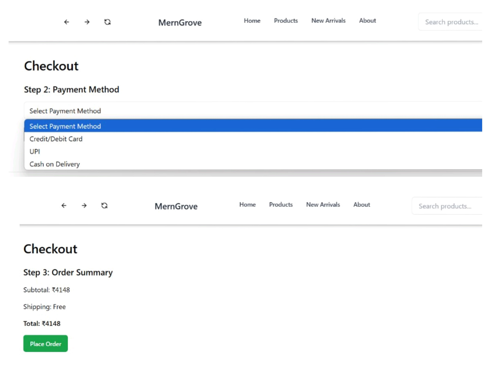

- Order Confirmation
  
  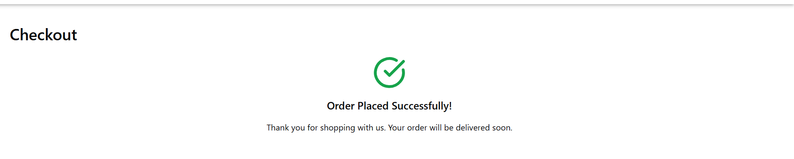

---

## How to Run the Project

### Prerequisites
- Node.js and npm installed

---

### Frontend Setup

### Clone the repo
```bash
git clone https://github.com/ASHRITH-SAMBARAJU/MERNGROVE-INTERIOR-DECOR-APPLICATION.git
```
### Navigate into project directory
```bash
cd MERNGROVE-INTERIOR-DECOR-APPLICATION
```
### Install dependencies
```bash
npm install
```
### Run the development server
```bash
npm start / npm run dev
```

## Contact

**Ashrith Sambaraju**  
Email: [ashrithsambaraju@gmail.com](mailto:ashrithsambaraju@gmail.com)  
LinkedIn: [linkedin.com/in/ashrith-sambaraju](https://www.linkedin.com/in/ashrith-sambaraju)  


